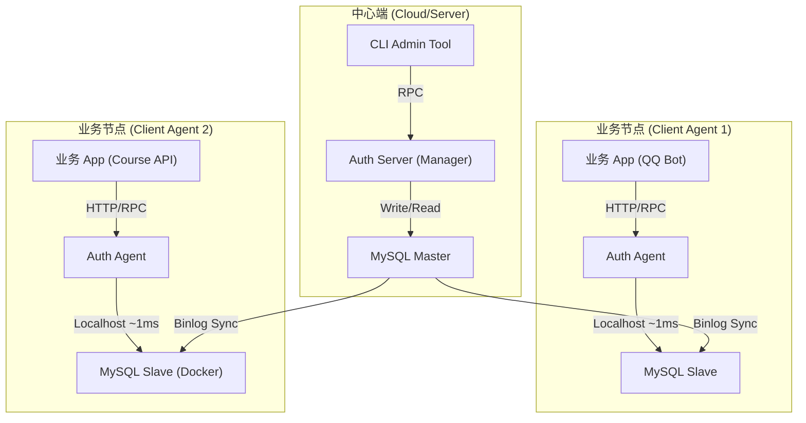

# 司契权限系统

司契权限系统是一个基于 C++ 和 bRPC 开发的高性能、中心化权限控制服务。它采用 RBAC（基于角色的访问控制）模型，为微服务架构中的其他应用（如 QQ 机器人、青鸾系统等）提供统一的权限校验能力。

## 核心特性

- **高性能 RPC**：基于百度 bRPC 框架，支持高并发低延迟调用。
- **安全鉴权**：基于 Token 的管理员登录与会话管理，杜绝身份伪造。
- **本地缓存**：权限数据本地缓存，提升权限检查性能，减少数据库访问压力。
- **审计日志**：自动记录所有管理操作，追踪到具体操作人，保障系统安全。
- **持久化存储**：使用 MySQL 存储权限数据。
- **多语言接入**：提供 Node Agent (Sidecar) 模式，通过 HTTP 接口支持 Python/Java/Go 等多语言无缝接入，零 SDK 依赖。

## 技术栈

- **RPC 框架**: [Apache bRPC](https://github.com/apache/brpc)
- **序列化**: Protocol Buffers 3
- **数据库**: MySQL (使用 MySQL Connector/C++)
- **构建工具**: CMake 3.10+

## 项目结构

```
siqi_auth/                          # 项目根目录
├── conf/                           # 配置文件目录
│   ├── agent.conf                  # Agent 配置文件 (连接本地 Slave)
│   └── server.conf                 # 服务端配置文件 (连接远程 Master)
├── include/                        # 头文件目录
│   ├── admin_service_impl.h        # 管理服务接口实现类定义
│   ├── auth_agent.h                # Agent 业务逻辑实现类定义
│   ├── auth_service_impl.h         # 鉴权服务接口实现类定义
│   ├── auth.pb.h                   # [自动生成] Protobuf 生成的 C++ 头文件
│   ├── local_cache.h               # 本地缓存实现，提升权限检查性能
│   └── permission_dao.h            # 数据访问层（DAO）接口定义，负责数据库交互
├── proto/                          # RPC 接口定义目录
│   └── auth.proto                  # Protobuf 文件，定义服务接口与消息结构
├── scripts/                        # 辅助脚本目录
│   ├── init.sql                    # 初始化数据库脚本
│   ├── deploy_db.sh                # 一键部署 Master 数据库 (Docker)
│   ├── start_server.sh             # 启动管理服务端
│   └── master_snapshot.sql         # [生成] 主从同步数据快照
├── src/                            # 源代码目录
│   ├── admin_service_impl.cpp      # 管理服务具体逻辑实现
│   ├── admin_tool.cpp              # CLI 管理工具
│   ├── auth_service_impl.cpp       # 鉴权服务具体逻辑实现
│   ├── auth_agent.cpp              # Agent 主入口，负责初始化本地数据库连接
│   ├── auth_agent_impl.cpp         # Agent 逻辑，直连本地 Slave 进行查询
│   ├── auth.pb.cc                  # [自动生成] Protobuf 生成的 C++ 源文件
│   ├── client_example.cpp          # 客户端 SDK 调用示例代码
│   ├── permission_dao.cpp          # 数据库操作具体实现（CRUD）
│   └── server_main.cpp             # 服务端主入口，负责初始化与启动 bRPC 服务
├── test/                           # 测试目录
│   └── perf_test.cpp               # 性能测试工具，多线程压测 AuthService
├── third_party/                    # 第三方依赖 Bazel 构建规则
│   ├── BUILD                       # 包声明文件
│   ├── protobuf.BUILD              # Protobuf 构建规则（含 protoc 编译器）
│   ├── leveldb.BUILD               # LevelDB 构建规则
│   ├── zlib.BUILD                  # Zlib 构建规则
│   ├── openssl.BUILD               # OpenSSL 构建规则（链接系统库）
│   └── mysqlcppconn.BUILD          # MySQL Connector/C++ 构建规则（链接系统库）
├── BUILD.bazel                     # Bazel 构建脚本，定义项目目标与依赖关系
├── WORKSPACE                       # Bazel 工作空间配置，声明外部依赖（bRPC, Protobuf 等）
├── .bazelrc                        # Bazel 构建选项配置
├── .bazelversion                   # 指定 Bazel 版本 (6.4.0)
├── CMakeLists.txt                  # CMake 构建脚本，定义依赖与编译规则
└── README.md                       # 项目说明文档
```

## 部署架构 (V2.0 - 分布式读写分离)

为解决高并发下的网络延迟问题，本项目采用了 **Agent + 本地数据库副本 (Local DB Replica)** 的架构模式。

### 架构图



### 核心优势
1.  **极速鉴权**：业务查权限就像查本机文件一样快 (延迟 < 1ms)，完全消除网络 RTT。
2.  **高可用**：即使中心端网络中断或 Master 宕机，Agent 依然可以依靠本地数据正常工作。
3.  **读写分离**：鉴权流量全部由各节点的 Slave 承担，中心 Master 只负责管理操作的写入。

---

## 环境准备 (Ubuntu 22.04)(cmake)

确保系统安装了必要的构建工具和依赖库：

```bash
# 基础构建工具
sudo apt install -y git g++ cmake make pkg-config

# 依赖库
sudo apt install -y libssl-dev libgflags-dev libprotobuf-dev protobuf-compiler libleveldb-dev libprotoc-dev

# MySQL Connector/C++
sudo apt install -y libmysqlcppconn-dev
```

bRPC 安装（参考[brpc的安装与使用介绍以及channel的封装](https://blog.csdn.net/m0_74189279/article/details/149484082)）：

```bash
git clone https://github.com/apache/brpc.git 
cd brpc/
mkdir build && cd build
cmake -DCMAKE_INSTALL_PREFIX=/usr .. && cmake --build . -j4
make && sudo make install
```

## 编译构建

```bash
cmake -B build
make -C build/ -j`nproc`
```

构建完成后，`build/` 目录下将生成以下可执行文件：
- `auth_server`: 权限系统服务端 (连接 Master)
- `auth_agent`: 节点级 Sidecar 代理 (连接 Local Slave)
- `admin_tool`: 命令行管理工具
- `perf_test`: 性能压测工具

---
## 环境准备 (Ubuntu 22.04)(Bazel)

Bazel 构建系统会自动从网络下载并编译大部分依赖（bRPC、Protobuf、gflags、LevelDB、Zlib），仅需安装少量系统级依赖：

```bash
# 基础构建工具
sudo apt install -y git g++ make

# Bazel 依赖的系统库（OpenSSL、MySQL Connector/C++ 通过系统安装提供）
sudo apt install -y libssl-dev libmysqlcppconn-dev
```

### 安装 Bazel 6.4.0

```bash
# 方式一：通过 Bazelisk（会自动读取 .bazelversion 文件选择版本）
sudo wget -qO /usr/local/bin/bazel https://github.com/bazelbuild/bazelisk/releases/download/v1.19.0/bazelisk-linux-amd64
sudo chmod +x /usr/local/bin/bazel
bazel --version  # 首次运行会自动下载 Bazel 6.4.0

### 编译构建

```bash
# 编译所有目标（推荐）
bazel build //...

# 或单独编译指定目标
bazel build //:auth_server
bazel build //:test_client
bazel build //:admin_tool
bazel build //:auth_agent
bazel build //:perf_test
```

构建完成后，可执行文件位于 `bazel-bin/` 目录下：
- `bazel-bin/auth_server`: 权限系统服务端 (连接 Master)
- `bazel-bin/auth_agent`: 节点级 Sidecar 代理 (连接 Local Slave)
- `bazel-bin/admin_tool`: 命令行管理工具
- `bazel-bin/test_client`: 客户端示例
- `bazel-bin/perf_test`: 性能压测工具


---
## 部署指南 (Step-by-Step)

### 1. 中心端 (Master Node) 部署

**目标**：部署 MySQL Master 和 Auth Server。

1.  **启动 MySQL Master (Docker)**:
    使用内置脚本启动并自动配置 Replication 账号：
    ```bash
    sudo ./scripts/deploy_db.sh
    ```
    *该脚本会创建一个名为 `siqi_mysql_prod` 的容器，Server-ID=1，账号: `siqi_dev`/`siqi123`，同步账号: `repl`/`slave123`。*

2.  **准备同步数据**:
    在中心端导出当前数据快照（包含同步坐标）：
    ```bash
    sudo docker exec siqi_mysql_prod mysqldump -uroot -proot123 \
      --databases siqi_auth \
      --master-data=1 \
      --single-transaction > slave_init.sql
    ```
    *将生成的 `slave_init.sql` 发送到所有业务节点。*

3.  **启动管理服务**:
    ```bash
    ./scripts/start_server.sh
    ```

---

### 2. 业务节点 (Agent Node) 部署

**目标**：在业务机器上部署 MySQL Slave 和 Auth Agent。

#### 方案 A: 使用 Docker 部署 Slave (推荐)

1.  **启动 Slave 数据库**:
    将 `slave_init.sql` 放入当前目录，运行：
    ```bash
    # 注意修改 server-id (每个节点必须唯一，如 2, 3, 4...)
    # 映射端口到宿主机 3306
    docker run -d --name auth_slave_db \
      --restart always \
      -p 3306:3306 \
      -e MYSQL_ROOT_PASSWORD=slave_root_123 \
      -v $(pwd)/slave_init.sql:/docker-entrypoint-initdb.d/init.sql \
      mysql:8.0 \
      --server-id=2 \
      --log-bin=mysql-bin --binlog-format=ROW
    ```

2.  **建立 SSH 隧道 (打通网络)**:
    由于 Master 在内网或有防火墙，通过 SSH 隧道连接最安全：
    ```bash
    # 将远程 Master 的 3306 映射到本机的 13306
    ssh -N -f -L 13306:127.0.0.1:3306 ubuntu@<Master_IP>
    ```

3.  **配置并启动同步**:
    进入 Slave 容器，配置 Master 地址为宿主机刚才开启的隧道端口：
    ```bash
    docker exec -it auth_slave_db mysql -uroot -pslave_root_123
    ```
    ```sql
    STOP SLAVE;
    -- 172.17.0.1 是 Docker 宿主机网关 IP
    CHANGE MASTER TO MASTER_HOST='172.17.0.1', MASTER_PORT=13306, 
      MASTER_USER='repl', MASTER_PASSWORD='slave123', GET_MASTER_PUBLIC_KEY=1;
    START SLAVE;
    SHOW SLAVE STATUS\G  -- 检查 Slave_IO_Running 和 Slave_SQL_Running 是否为 Yes
    ```

4.  **启动 Agent**:
    修改 `conf/agent.conf` 连接本地数据库（127.0.0.1:3306），然后启动：
    ```bash
    ./build/auth_agent --flagfile=conf/agent.conf
    ```

#### 方案 B: 使用原生 MySQL 部署 Slave

1.  安装 MySQL Server，修改 `/etc/mysql/mysql.conf.d/mysqld.cnf` 设置 `server-id = 2` 并重启。
2.  导入快照：`sudo mysql < slave_init.sql`。
3.  配置 Master（同上，Host 填 `127.0.0.1` 即可）。
4.  创建 Agent 专用账号：
    ```sql
    CREATE USER 'agent_user'@'127.0.0.1' IDENTIFIED BY 'agent123';
    GRANT SELECT ON siqi_auth.* TO 'agent_user'@'127.0.0.1';
    ```
5.  启动 Agent。

---

## 运行服务

### 验证与监控

1.  **检查 Agent 状态**:
    ```bash
    curl "http://127.0.0.1:8881/AuthService/Check?app_code=test&user_id=1&perm_key=test" -v
    ```
    *Response Header 应包含 `X-Strategy: Local-DB-Slave`*

2.  **性能压测**:
    ```bash
    ./build/perf_test --server=127.0.0.1:8881 --threads=20 --duration=30
    ```
    *预期性能: QPS > 20k, Latency < 1ms*

### 数据库配置 (Server)

启动输出示例：
```
I0212 20:47:43.613006 20766     0 /home/justin/siqi_auth/src/auth_service_impl.cpp:15 AuthServiceImpl] 数据库连接成功
I0212 20:47:43.629907 20766     0 /home/justin/brpc/src/brpc/server.cpp:1232 StartInternal] Server[AuthServiceImpl+AdminServiceImpl] is serving on port=8888.
I0212 20:47:43.630029 20766     0 /home/justin/brpc/src/brpc/server.cpp:1235 StartInternal] Check out http://justin-Inspiron:8888 in web browser.
I0212 20:47:43.630126 20766     0 /home/justin/siqi_auth/src/server_main.cpp:36 main] 司契权限系统启动成功，监听端口: 8888
I0212 20:47:43.630136 20766     0 /home/justin/siqi_auth/src/server_main.cpp:37 main] 其他系统可以通过 brpc://localhost:8888 调用
```

## 接入方式（多语言支持）

本项目推荐采用 **Node Agent (节点级 Sidecar) + Local DB Replica** 模式接入。

### 为什么选择这种模式？

- **极致性能**：Agent 直接查询本地从库，没有网络 I/O，延迟稳定在 <1ms。
- **高可用**：Master 宕机不影响现有权限查询；Agent 宕机只需重启。
- **解耦**：业务代码无需连接远程中心，不用处理复杂的 RPC 重试和熔断。

### 1. 部署架构

*见上文架构图*

### 2. 启动 Agent

在每台业务服务器上运行一个 Agent 守护进程。建议使用配置文件启动：

```bash
# 推荐：使用配置文件启动
./build/auth_agent --flagfile=conf/agent.conf

# 验证 Agent 是否正常工作
curl "http://127.0.0.1:8881/AuthService/Check?app_code=test&user_id=1&perm_key=test"
```

### 3. 业务代码调用示例

**Python:**
```python
import requests
# 直接访问本机 Agent
resp = requests.get("http://127.0.0.1:8881/AuthService/Check", params={
    "app_code": "qq_bot",
    "user_id": "10086",
    "perm_key": "member:kick"
})
if resp.json().get("allowed"):
    print("允许操作")
```

**Curl (测试):**
```bash
# 模拟一次请求
curl "http://127.0.0.1:8881/AuthService/Check?app_code=qq_bot&user_id=123456&perm_key=member:kick"
```

### 4. 接口返回格式 (JSON)

Agent 接口返回标准的 JSON 对象：

**成功允许 (Allowed):**
```json
{
  "allowed": true,
}
```

**拒绝访问 (Denied):**
```json
{
  "reason": "用户没有该权限" // 或 "参数不完整", "服务端异常" 等
}
```

> **注意**：根据 Protobuf 3 序列化规范，当 `allowed` 字段值为 `false`（默认值）时，该字段如果不显示，即代表拒绝。


**Header 辅助信息:**
Agent 会在响应 Header 中添加 `X-Strategy` 字段：
- `X-Strategy: Local-DB-Slave`  - 标识本次请求是由本地从库直接响应的。

## CLI 管理工具

使用 `admin_tool` 进行管理操作（如创建应用、管理用户等）。这些操作会直接写 Master 库，然后自动同步给所有 Agent。

```bash
# 1. 管理员登录 (获取 Token)
# 默认连接 Master (localhost:8888)
./build/admin_tool --op=login --user=admin --password=admin123

# 2. 创建一个新权限 (立即同步给所有 Slave)
./build/admin_tool --op=create_perm --perm=drive:upload --name="上传文件" --desc="允许上传"

# 3. 授权给用户
./build/admin_tool --op=grant_perm --user=10086 --perm=drive:upload
```

所有写操作都会通过 Binlog 在毫秒级时间内同步到各个业务节点的 Slave 数据库中。

## 测试客户端

运行测试客户端以验证服务是否正常工作：

```bash
./build/test_client
```

客户端会尝试连接本地服务器并进行一次模拟的权限检查。

## 接口定义

服务接口定义在 `proto/auth.proto` 中：

- `CheckRequest`: 包含 `app_code` (应用标识), `user_id` (用户ID), `perm_key` (权限标识)。
- `CheckResponse`: 返回 `allowed` (布尔值) 表示是否拥有权限。

当接口文件发生变更时，请重新生成对应的 C++ 代码：

```bash
protoc --proto_path=proto --experimental_allow_proto3_optional --cpp_out=src proto/auth.proto && mv src/auth.pb.h include/
```


## 未来优化方向
**已完成：多语言接入方案（Agent 模式）**

| 功能 | 当前状态 | 计划中 |
|------|-----------|---------------|
| **配置管理** | ✅ 支持 gflags (命令行/文件) | 动态配置中心 (Etcd) |
| **接入方式** | ✅ Node Agent (HTTP/Local DB) | SDK (直连 Slave) |
| **高可用** | ✅ 读写分离，本地容灾 | Master 故障自动选举 (MHA) |
| **多级缓存** | ✅ MySQL Page Cache | Redis (如果 QPS > 100k) |

