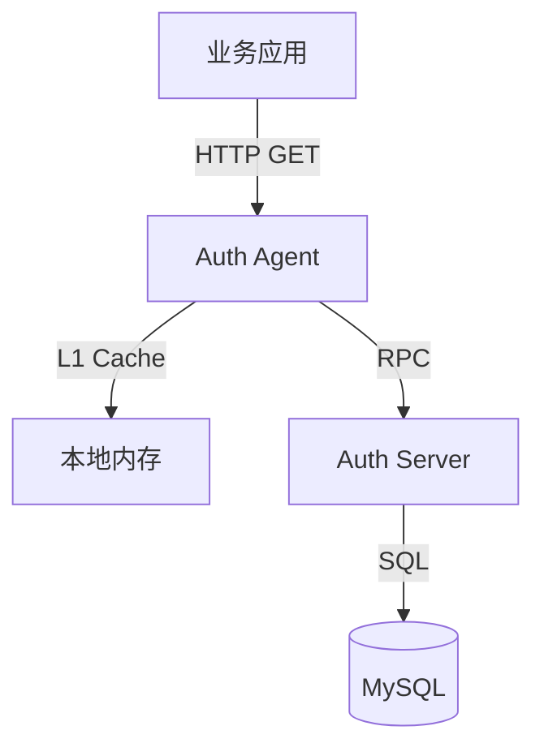

# 司契权限系统

司契权限系统是一个基于 C++ 和 bRPC 开发的高性能、中心化权限控制服务。它采用 RBAC（基于角色的访问控制）模型，为微服务架构中的其他应用（如 QQ 机器人、青鸾系统等）提供统一的权限校验能力。

## 核心特性

- **高性能 RPC**：基于百度 bRPC 框架，支持高并发低延迟调用。
- **安全鉴权**：基于 Token 的管理员登录与会话管理，杜绝身份伪造。
- **本地缓存**：权限数据本地缓存，提升权限检查性能，减少数据库访问压力。
- **审计日志**：自动记录所有管理操作，追踪到具体操作人，保障系统安全。
- **持久化存储**：使用 MySQL 存储权限数据。
- **多语言接入**：提供 Node Agent (Sidecar) 模式，通过 HTTP 接口支持 Python/Java/Go 等多语言无缝接入，零 SDK 依赖。

## 技术栈

- **RPC 框架**: [Apache bRPC](https://github.com/apache/brpc)
- **序列化**: Protocol Buffers 3
- **数据库**: MySQL (使用 MySQL Connector/C++)
- **构建工具**: CMake 3.10+

## 项目结构

```
siqi_auth/                      # 项目根目录
├── build/                      # 编译输出目录
├── conf/                       # 配置文件目录
│   ├── agent.conf              # Agent 配置文件示例
│   └── server.conf             # 服务端配置文件示例
├── include/                    # 头文件目录
│   ├── admin_service_impl.h    # 管理服务接口实现类定义
│   ├── auth_agent.h            # Agent 业务逻辑实现类定义
│   ├── auth_service_impl.h     # 鉴权服务接口实现类定义
│   ├── auth.pb.h               # [自动生成] Protobuf 生成的 C++ 头文件
│   ├── local_cache.h           # 本地缓存实现，提升权限检查性能
│   └── permission_dao.h        # 数据访问层（DAO）接口定义，负责数据库交互
├── proto/                      # RPC 接口定义目录
│   └── auth.proto              # Protobuf 文件，定义服务接口（Check, BatchCheck）与消息结构
├── scripts/                    # 辅助脚本目录
│   └── init.sql                # 初始化数据库脚本，创建所需表与初始数据
├── src/                        # 源代码目录
│   ├── admin_service_impl.cpp  # 管理服务具体逻辑实现
│   ├── admin_tool.cpp          # CLI 管理工具
│   ├── auth_service_impl.cpp   # 鉴权服务具体逻辑实现
│   ├── auth_agent.cpp          # Agent 业务逻辑实现入口，处理 HTTP 请求并调用远程 Server
│   ├── auth_agent_impl.cpp     # Agent 业务逻辑实现
│   ├── auth.pb.cc              # [自动生成] Protobuf 生成的 C++ 源文件
│   ├── client_example.cpp      # 客户端 SDK 调用示例代码
│   ├── permission_dao.cpp      # 数据库操作具体实现（CRUD）
│   └── server_main.cpp         # 服务端主入口，负责初始化与启动 bRPC 服务
├── CMakeLists.txt              # CMake 构建脚本，定义依赖与编译规则
└── README.md                   # 项目说明文档
```

## 环境准备 (Ubuntu 22.04)

确保系统安装了必要的构建工具和依赖库：

```bash
# 基础构建工具
sudo apt install -y git g++ cmake make

# 依赖库
sudo apt install -y libssl-dev libgflags-dev libprotobuf-dev protobuf-compiler libleveldb-dev

# MySQL Connector/C++
sudo apt install -y libmysqlcppconn-dev
```

bRPC 安装（参考[brpc的安装与使用介绍以及channel的封装](https://blog.csdn.net/m0_74189279/article/details/149484082)）：

```bash
git clone
cd brpc/
mkdir build && cd build
cmake -DCMAKE_INSTALL_PREFIX=/usr ... && cmake --build . -j8
sudo make install
```

## 编译构建

```bash
cmake -B build
make -C build/ -j`nproc`
```

构建完成后，`build/` 目录下将生成以下可执行文件：
- `auth_server`: 权限系统服务端
- `auth_agent`: 节点级 Sidecar 代理 (Node Agent)
- `test_client`: 测试用客户端

## 数据库配置

项目默认使用 MySQL 数据库，默认配置如下：
- **Host**: `localhost`
- **Port**: `3306`
- **User**: `siqi_dev`
- **Password**: `siqi123`
- **Database**: `siqi_auth`

### 初始化数据库

```bash
sudo mysql < scripts/init.sql
```

### 连接到数据库

```bash
mysql -u siqi_dev -p siqi_auth
# 输入密码: siqi123
```

## 运行服务

1. **启动 MySQL** 并确保数据库已初始化。
2. **启动权限服务器**：

可以通过命令行参数或配置文件启动：

```bash
# 方式1：默认配置启动 (端口 8888, localhost:3306)
./build/auth_server

# 方式2：通过命令行指定配置
./build/auth_server --port=9000 --db_host=127.0.0.1

# 方式3：通过配置文件启动（推荐）
./build/auth_server --flagfile=conf/server.conf
```

服务器默认监听端口 **8888**。

启动输出示例：
```
I0212 20:47:43.613006 20766     0 /home/justin/siqi_auth/src/auth_service_impl.cpp:15 AuthServiceImpl] 数据库连接成功
I0212 20:47:43.629907 20766     0 /home/justin/brpc/src/brpc/server.cpp:1232 StartInternal] Server[AuthServiceImpl+AdminServiceImpl] is serving on port=8888.
I0212 20:47:43.630029 20766     0 /home/justin/brpc/src/brpc/server.cpp:1235 StartInternal] Check out http://justin-Inspiron:8888 in web browser.
I0212 20:47:43.630126 20766     0 /home/justin/siqi_auth/src/server_main.cpp:36 main] 司契权限系统启动成功，监听端口: 8888
I0212 20:47:43.630136 20766     0 /home/justin/siqi_auth/src/server_main.cpp:37 main] 其他系统可以通过 brpc://localhost:8888 调用
```

## 接入方式（多语言支持）

本项目推荐采用 **Node Agent (节点级 Sidecar)** 模式接入。

### 为什么选择 Agent？

- **无需 SDK**：业务方（Java/Python/Go）只需发起简单的 HTTP 请求。
- **本地缓存**：Agent 内部实现了高性能缓存（TTL 可配），99% 的请求在毫秒级返回，无需穿透到 Server。
- **解耦**：当权限系统升级协议时，业务代码无需改动。

### 1. 部署架构



### 2. 启动 Agent

在每台业务服务器上运行一个 Agent 守护进程。建议使用配置文件启动：

```bash
# 推荐：使用配置文件启动
./build/auth_agent --flagfile=conf/agent.conf

# 或者：命令行参数覆盖
./build/auth_agent --port=8881 --server=192.168.1.100:8888 --cache_ttl=60
```

### 3. 业务调用示例

**Python:**
```python
import requests
# 直接访问本机 Agent
resp = requests.get("http://127.0.0.1:8881/AuthService/Check", params={
    "app_code": "qq_bot",
    "user_id": "10086",
    "perm_key": "member:kick"
})
if resp.json().get("allowed"):
    pass # 允许操作
```

**Curl (测试):**
```bash
curl "http://127.0.0.1:8881/AuthService/Check?app_code=qq_bot&user_id=123456&perm_key=member:kick"
```

### 4. 接口返回格式 (JSON)

Agent 接口返回标准的 JSON 对象：

**成功允许 (Allowed):**
```json
{
  "allowed": true,
}
```

**拒绝访问 (Denied):**
```json
{
  "reason": "用户没有该权限" // 或 "参数不完整", "服务端异常" 等
}
```

> **注意**：根据 Protobuf 3 序列化规范，当 `allowed` 字段值为 `false`（默认值）时，该字段如果不显示，即代表拒绝。


**Header 辅助信息:**
Agent 会在响应 Header 中添加 `X-Cache` 字段以标识缓存命中情况：
- `X-Cache: HIT`  - 命中 Agent 本地缓存 (极速)
- `X-Cache: MISS` - 未命中，已穿透请求至远程 Server
- `X-Cache: ERROR`- 远程 Server 不可用，触发默认拒绝

## CLI 管理工具

使用 `admin_tool` 进行管理操作（如创建应用、管理用户等）。操作前必须先登录：

```bash
# 1. 管理员登录 (获取 Token)
./build/admin_tool --op=login --user=admin --password=admin123

# 2. 执行管理操作 (自动携带 Token)
./build/admin_tool --op=list_roles
./build/admin_tool --op=create_perm --perm=user:del --name="删除用户" --desc="危险操作"
```

## 测试客户端

运行测试客户端以验证服务是否正常工作：

```bash
./build/test_client
```

客户端会尝试连接本地服务器并进行一次模拟的权限检查。

## 接口定义

服务接口定义在 `proto/auth.proto` 中：

- `CheckRequest`: 包含 `app_code` (应用标识), `user_id` (用户ID), `perm_key` (权限标识)。
- `CheckResponse`: 返回 `allowed` (布尔值) 表示是否拥有权限。

当接口文件发生变更时，请重新生成对应的 C++ 代码：

```bash
protoc --proto_path=proto --experimental_allow_proto3_optional --cpp_out=src proto/auth.proto && mv src/auth.pb.h include/
```


## 未来优化方向
**已完成：多语言接入方案（Agent 模式）**

| 功能 | 当前状态 | 计划中 |
|------|-----------|---------------|
| **配置管理** | ✅ 支持 gflags (命令行/文件) | 动态配置中心 (Etcd) |
| **接入方式** | ✅ Node Agent (HTTP) | SDK (高性能直连场景) |
| **熔断降级** | ⚠️ Agent 端有基础超时 | 完善的熔断指标统计 |
| **多级缓存** | ✅ 本地内存缓存 | Redis 分布式缓存 |

